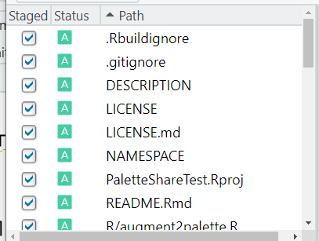

<!-- README.md is generated from README.Rmd. Please edit that file -->

```{r, include = FALSE}
knitr::opts_chunk$set(
  collapse = TRUE,
  comment = "#>",
  fig.path = "man/figures/README-",
  out.width = "100%"
)
```

This package is a template for creating your own custom color palette package. Having your own color palette package will make it easy for you (and your labmates, teammates, etc) to use a consistent color palette for the same identifiers in your data. For example, the Wolfe Lab at Tufts University has approximately a dozen members working with the same species of microbes. I wrote [WolfeR](https://github.com/cbedwards/wolfeR) to make it trivial for each lab member to use the same colors to refer to the same species.

## Working with packages in R

If this is your first time developing your own R package, welcome! You'll need to set up a few things before you get started with this package in particular, but once you do, you're set to make as many packages as your heart desires! "Developing your own package" may sound scary, but the actual package development with `PalettePackager` will only involve modifying a couple of files. I'll walk through that process below. For a broader treatment of package development, [check out this awesome resource](https://r-pkgs.org/).

First things first:

-   You'll probably want git and to set up github for version control and for deploying your package so that your teammates/labmates can use it too. (These are both free). It's a bit involved to explain here, but there's an excellent walk-through on using git with Rstudio at [Happy Git with R](https://happygitwithr.com/). I'm going to assume you're using GitHub to share your package, so you'll need to create a GitHub account if you don't have one.
-   You'll need the (free) software to compile an R package. These vary by operating system, and there's a nice summary with links [here](https://support.posit.co/hc/en-us/articles/200486498-Package-Development-Prerequisites).
-   You'll need to install the `devtools` library. If you start to explore more package development, you'll probably want the `usethis` and `testthat` packages, so you might install them now.

## Using this template to make your own package

There are several ways to create a new git repository with this project's files in the template, but an easy one is:

1.  Make a new, empty repository on GitHub for yourself. Call it whatever you want to call your version of the package. Things will probably be less confusing for you if it has a name that's distinct from `PalettePackager`. For this demonstration, I'm creating a new package that I'm calling `PaletteShareTest`. (Note that since this is on *your* github account, it can have the same name as mine! It might just get confusing to keep track of.)

2.  In Rstudio, make a new project, and choose "Version Control" in the creation wizard

3.  Give the web address of your new GitHub repository in the creation wizard. Pro tip: it's nice to have a repositories folder on your computer, that all your repos can live in. I've creatively called mine "repos". Git and GitHub will be acting as your backup and cross-computer access, so this doesn't need to live within a cloud storage drive like dropbox.\
    This will create a folder on your computer that will house your new package. This will also open up Rstudio in the project for that packaged. But it's empty! Let's get all the files from the template

4.  Download the directory of PalettePackager from my GitHub page to on your own computer. On a browser, you can click on the "Code" button to get a dropdown with an option to download a ZIP of the directory

5.  We want to move most of those files to our new project directory, but not the ones that were already created when we made our *new* project (except .gitignore, which we want to move). Extract the contents from that zipped folder somewhere convenient. Copy the contents to the folder of your new project EXCEPT: the hidden `.git` folder, the hiden `.Rproj.user` folder, and the `PalettePackager.Rproj` file. You will get asked if you want to replace the "old" .gitignore file with the new one you copied in. Yes you do.

    Wooo! We should be there! You'll want to make this package your own, but we can do a quick check to make sure that everything worked! Try running the following code:

```{=html}
<!-- -->
```
    library(devtools) #this loads the package-making packages we want.
    check()

This will run through a bunch of diagnostics to make sure the new package is viable (this will take a few minutes). You should get no errors or warnings, but you'll get a note about a non-standard file/directory at the top level. This is because you haven't changed the name of the package, and the diagnostics tools are noticing that your project name isn't the same as your package name. If you want to, you can even install your package on your local machine already, using the `install()` command.

## Making the package yours

Before we worry about adding your custom color palettes, let's update the package description to use *your* name and *your* package name. Open the DESCRIPTION file. We can easily access it using the "Files" window in Rstudio:


With that file open:

1.  Change the package name to the exact name of your project folder. You can also change the title to something more meaningful to you

2.  Update the author information to represent your name, email address, and ORCID rather than mine. If you don't have an ORCID, you can just cut out the entire `comment =`... bit. 

3.  You should probably also update the description line to be meaningful for your project\
    

4.  Make sure you've saved your DESCRIPTION file.

5.  `PalettePackager` includes a few tests written using the `testthat` framework. We need to update the settings for `testthat` with your new package name. We can do that with

        library(usethis)
        use_testthat()

    When it asks, yes we want to overwrite the previous file `test/testthat.R`

6.  Update your readme with a blank slate:\

```{=html}
<!-- -->
```
    library(usethis)
    use_readme_rmd()
    build_readme()

When it asks, yes you want to overwrite the old .Rmd file.

You did it! Your package is now YOUR package (although it currently doesn't have any new packages). To make sure everything worked, run `check()` again. You should be all clear expect for that same pesky note, which we'll get to in a bit.

This is probably a good time to commit and push to github. Check out [Happy Git with R](https://happygitwithr.com/) for details, but you should be able to hit the "GIT" button on the main menu, and choose the "commit" option\


Then hit the checkbox next to each item to make sure they are "staged" (telling git that yes, you want to track them).

\
Add a commit message explaining what you've done at this point (ie "Setting up my package, have updated authorship and package names"), and hit the "commit" button.

You'll get a window pop up with the details as git commits your files. (This is also where potential issues can pop up, if something didn't work right). When it's done, a bunch of details will show in the window, and the "Stop" button will turn into a "Close button. The commit is a checkpoint in git which you can revert back to if anything goes sideways in the future. Right now, though, your commit is only your computer. To push this commit (including the files and directory structure) to your GitHub repository, hit the "push" button.


Now you should be able to see the directory structure and files in your github repository. Victory!

## Outline of the idea

## Example using PalmerPenguin data
