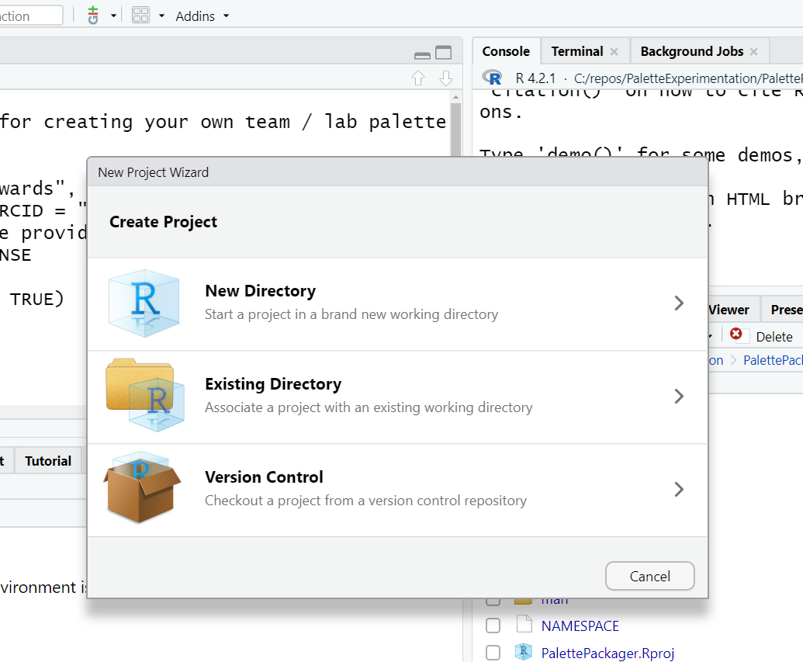
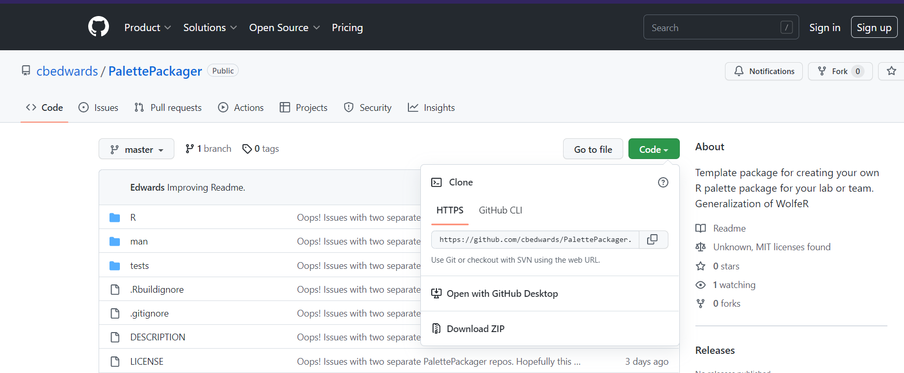
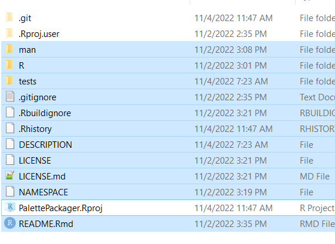
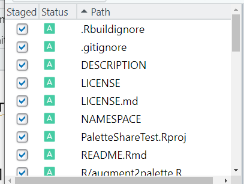
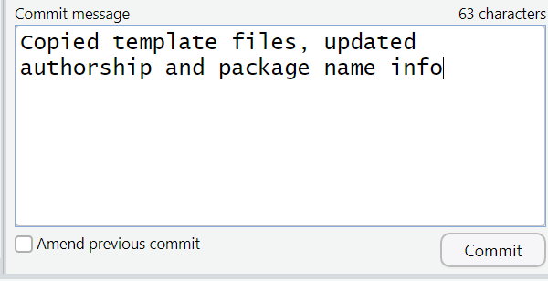
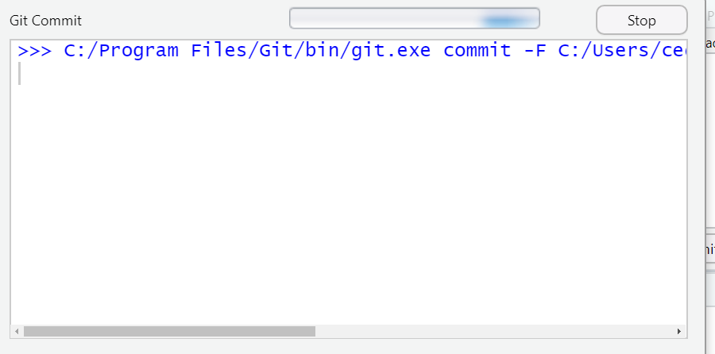

<!-- README.md is generated from README.Rmd. Please edit that file -->

This package is a template for creating your own custom color palette
package. Having your own color palette package will make it easy for you
(and your labmates, teammates, etc) to use a consistent color palette
for the same identifiers in your data. For example, the Wolfe Lab at
Tufts University has approximately a dozen members working with the same
species of microbes. I wrote
[WolfeR](https://github.com/cbedwards/wolfeR) to make it trivial for
each lab member to use the same colors to refer to the same species.

## Working with packages in R

If this is your first time developing your own R package, welcome!
You’ll need to set up a few things before you get started with this
package in particular, but once you do, you’re set to make as many
packages as your heart desires! “Developing your own package” may sound
scary, but the actual package development with `PalettePackager` will
only involve modifying a couple of files. I’ll walk through that process
below. For a broader treatment of package development, [check out this
awesome resource](https://r-pkgs.org/).

First things first:

-   You’ll probably want git and to set up github for version control
    and for deploying your package so that your teammates/labmates can
    use it too. (These are both free). It’s a bit involved to explain
    here, but there’s an excellent walk-through on using git with
    Rstudio at [Happy Git with R](https://happygitwithr.com/). I’m going
    to assume you’re using GitHub to share your package, so you’ll need
    to create a GitHub account if you don’t have one.
-   You’ll need the (free) software to compile an R package. These vary
    by operating system, and there’s a nice summary with links
    [here](https://support.posit.co/hc/en-us/articles/200486498-Package-Development-Prerequisites).
-   You’ll need to install the `devtools` library. If you start to
    explore more package development, you’ll probably want the `usethis`
    and `testthat` packages, so you might install them now.

## Using this template to make your own package

There are several ways to create a new git repository with this
project’s files in the template, but an easy one is:

1.  Make a new, empty repository on GitHub for yourself. Call it
    whatever you want to call your version of the package. Things will
    probably be less confusing for you if it has a name that’s distinct
    from `PalettePackager`. For this demonstration, I’m creating a new
    package that I’m calling `PaletteShareTest`. (Note that since this
    is on *your* github account, it can have the same name as mine! It
    might just get confusing to keep track of.)

2.  In Rstudio, make a new project, and choose “Version Control” in the
    creation wizard

3.  Give the web address of your new GitHub repository in the creation
    wizard. Pro tip: it’s nice to have a repositories folder on your
    computer, that all your repos can live in. I’ve creatively called
    mine “repos”. Git and GitHub will be acting as your backup and
    cross-computer access, so this doesn’t need to live within a cloud
    storage drive like dropbox.  
    This will create a folder on your computer that will house your new
    package. This will also open up Rstudio in the project for that
    packaged. But it’s empty! Let’s get all the files from the template

4.  Download the directory of PalettePackager from my GitHub page to on
    your own computer. On a browser, you can click on the “Code” button
    to get a dropdown with an option to download a ZIP of the
    directory

5.  We want to move most of those files to our new project directory,
    but not the ones that were already created when we made our *new*
    project (except .gitignore, which we want to move). Extract the
    contents from that zipped folder somewhere convenient. Copy the
    contents to the folder of your new project EXCEPT: the hidden `.git`
    folder, the hiden `.Rproj.user` folder, and the
    `PalettePackager.Rproj` file. You will get asked if you want to
    replace the “old” .gitignore file with the new one you copied in.
    Yes you do.

    Wooo! We should be there! You’ll want to make this package your own,
    but we can do a quick check to make sure that everything worked! Try
    running the following code:

<!-- -->

    library(devtools) #this loads the package-making packages we want.
    check()

This will run through a bunch of diagnostics to make sure the new
package is viable (this will take a few minutes). You should get no
errors or warnings, but you’ll get a note about a non-standard
file/directory at the top level. This is because you haven’t changed the
name of the package, and the diagnostics tools are noticing that your
project name isn’t the same as your package name. If you want to, you
can even install your package on your local machine already, using the
`install()` command.

## Making the package yours

Before we worry about adding your custom color palettes, let’s update
the package description to use *your* name and *your* package name. Open
the DESCRIPTION file. We can easily access it using the “Files” window
in Rstudio:

With that file open:

1.  Change the package name to the exact name of your project folder.
    You can also change the title to something more meaningful to
    you

2.  Update the author information to represent your name, email address,
    and ORCID rather than mine. If you don’t have an ORCID, you can just
    cut out the entire `comment =`… bit. 

3.  You should probably also update the description line to be
    meaningful for your project  
    

4.  Make sure you’ve saved your DESCRIPTION file.

5.  `PalettePackager` includes a few tests written using the `testthat`
    framework. We need to update the settings for `testthat` with your
    new package name. We can do that with

        library(usethis)
        use_testthat()

    When it asks, yes we want to overwrite the previous file
    `test/testthat.R`

6.  Update your readme with a blank slate:  

<!-- -->

    library(usethis)
    use_readme_rmd()
    build_readme()

When it asks, yes you want to overwrite the old .Rmd file.

You did it! Your package is now YOUR package (although it currently
doesn’t have any new packages). To make sure everything worked, run
`check()` again. You should be all clear expect for that same pesky
note, which we’ll get to in a bit.

This is probably a good time to commit and push to github. Check out
[Happy Git with R](https://happygitwithr.com/) for details, but you
should be able to hit the “GIT” button on the main menu, and choose the
“commit” option  

Then hit the checkbox next to each item to make sure they are “staged”
(telling git that yes, you want to track them).

  
Add a commit message explaining what you’ve done at this point (ie
“Setting up my package, have updated authorship and package names”), and
hit the “commit” button.

You’ll get a window pop up with the
details as git commits your files. (This is also where potential issues
can pop up, if something didn’t work right).
When it’s done, a bunch of details will
show in the window, and the “Stop” button will turn into a “Close
button. The commit is a checkpoint in git which you can revert back to
if anything goes sideways in the future. Right now, though, your commit
is only your computer. To push this commit (including the files and
directory structure) to your GitHub repository, hit the”push” button.

Now you should be able to see the directory structure and files in your
github repository. Victory!

## Outline of the idea

## Example using PalmerPenguin data
